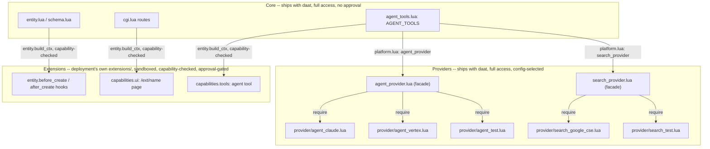

# Architecture

See `glossary.md` for the terms this codebase, its UI, and its agent tools should use consistently (Document vs page/Notebook, Entity vs record, Knowledge Pool tier names, capability names) -- check there before introducing a new name for something that already has one.

## Overview

The system is built around one idea: an entity type is data, not code you write per-type, and every change to an entity is remembered, not overwritten. Defining a new kind of entity (a reagent, a sample, a person) is authoring a small declarative definition; the platform takes care of storage, validation, a full audit trail, and a queryable table for that type. Nothing about using the system requires touching the platform's own source.

```
                     +------------------+
                     |   web server     |   Apache + mod_cgid, PATH_INFO-based
                     +--------+---------+   (src/cgi.lua is the single CGI entry point)
                              |
                     +--------v---------+
                     |       daat       |
                     | entity history,  |
                     | registration     |
                     | semantics,       |
                     | accounts/        |
                     | sessions,        |
                     | validation,      |
                     | lineage, queries |
                     +--------+---------+
                              |
                     +--------v---------+
                     |     storage      |   history log (append-only)
                     |                  |   one table per entity type
                     +------------------+   accounts
```

The application owns its full request/response cycle end to end: the web surface, accounts and permissions, and its own rendering. Record type, extension, and saved-query definitions are plain files, read and sandboxed at request time -- nothing external to run alongside it to make any of this work.

## Core vs. deployment content

daat's own source (`src/`) carries no domain-specific logic and has no required dependency on anything a deployment defines. Two separate guarantees, both easy to erode by accident, so both worth stating as hard invariants rather than an impression from reading the code once:

**No domain vocabulary in core.** Every table daat creates on its own (`init.do_init` -> each module's own `init_schema`) is infrastructure any deployment needs regardless of what it tracks: accounts/sessions (`auth.lua`), the entity-type/dropdown/junction-table machinery itself (`schema.lua`), audit history (`ledger.lua`), Documents and the Knowledge Pool (`document.lua`/`knowledge.lua`), extension/view approval (`extension.lua`/`view.lua`), and chat (`agent.lua`). None of it branches on a concrete entity type by name. The handful of places a word like "sample" or "reagent" shows up in `src/` at all -- `html.lua` placeholder text, the `/sql` console's example query in `cgi.lua`, a doc comment illustrating a mechanism -- are UI copy or comments, never a code path that behaves differently because a row happens to be a "sample." `document` is a deliberate, narrow exception: it's a built-in type registered directly in code (`document.lua`; see doc/schema.md) rather than a `schemas/*.lua` file, because its extra behavior (link parsing, backlinks, tiering) is tightly coupled to its exact field shape -- but that's a structural type (a folder tree of notes), not a domain one. `label_template` looks similar (`label.lua` has real, non-generic code built around it) but its actual field definition is still an ordinary deployment-authored schema file: the *printing mechanism* is core, the *shape of what gets printed* isn't.

**No required user-defined content.** A bare `daat init` (no `--with-examples`, empty `schemas/`/`dropdowns/`/`extensions/`/`views/`/`templates/` directories) is a fully working deployment on its own -- accounts, chat, Documents, and the Knowledge Pool all function with zero registered entity types. The Entity Types index has an explicit empty state ("No entity types registered yet.", `html.lua`'s `#entity_types == 0` branch) rather than assuming at least one exists, and the entity-facing agent tools (`entity.list_types`/`fields`/`relationships`) exist specifically so the model discovers whatever schemas a deployment happens to have registered, rather than the system prompt (or any core code) hardcoding an assumption about what they are. The general-purpose entity-tracking layer doc/schema.md describes is additive, opt-in structure a deployment layers on top -- never something core initialization, auth, chat, or the knowledge pool reach into or depend on already existing.

Together these are what make the split in doc/schema.md a hard boundary rather than a convention: whatever a deployment actually wants to track (a LIMS's `sample`/`cell_line`/`media_batch`, or anything else entirely) lives entirely in its own `schemas/`/`dropdowns/*.lua` files, interpreted generically by `schema.lua` -- daat's own repo never needs to change, or even know, what those concrete types are. The intent is a base deployment that's robust and minimal on its own, with (almost) all data-shape flexibility pushed out to config-as-code the deployment owns.

## Providers: a third tier between core and extensions

"Core vs. deployment content" above draws one line. In practice there are three tiers, not two -- the third exists in the code already (`agent_provider.lua`) but had never been named or documented as its own category until this section:

1. **Core** (`entity.lua`, `cgi.lua`, `schema.lua`, `agent_tools.lua`'s own `AGENT_TOOLS`, ...): full platform access, ships with daat, reviewed like any other commit, no approval workflow, not swappable.
2. **Providers** (`agent_provider.lua`/`search_provider.lua` and their implementations under `src/provider/`): also full access, also ships with daat, also no approval workflow -- but organized as a facade dynamically `require`-ing a named implementation module selected by a `platform.lua` field, so switching backends (or substituting a deterministic test stub) is a config change, never a core-file edit.
3. **Extensions** (a deployment's own `extensions/<name>/`): deployment-authored, sandboxed (`sandbox.extension_env`), capability-checked (`entity.build_ctx`'s narrow `query`/`create_entity`/`update_entity`), admin-approval-gated, invalidated on any capability change -- see "Sandboxed extensibility" below and doc/extensibility.md.

The dividing lines are two independent questions, not one spectrum: *is this deployment-specific, or does it ship with daat itself* (extensions vs. everything else), and *does this need an approval/capability-check boundary at all* (extensions need one because they're someone else's untrusted code; core and providers don't, because both are reviewed the same way daat's own source is). A provider exists because "ships with daat, fully trusted" and "hardcoded into one calling module" are two different properties -- a provider is for capability that's fully trusted but still benefits from being swappable.

Two real providers exist today, both following the exact same shape -- a thin facade file at the top of `src/`, its implementations one level down in `src/provider/`, picked by name via a `platform.lua` field:

- **`agent_provider.lua`** -> `src/provider/agent_claude.lua` / `agent_vertex.lua` / `agent_test.lua`, picked by `agent_provider` (default `"vertex"`).
- **`search_provider.lua`** -> `src/provider/search_google_cse.lua` / `search_test.lua`, picked by `search_provider` (default `"google_cse"`).



**Going forward, this is the default shape for any new external-tool integration** -- a facade + at least one named implementation module, config-selected, from the very first version, even before a second real backend exists to switch to. `web_search.lua`'s original shape (a single hardcoded Google Custom Search integration, no facade at all -- see doc/plugin-system-research.md's "gap, and it's not hypothetical" section) was the anti-pattern this fixes, not a model to repeat: it's exactly why `search_provider.lua` exists now. The cost of a facade with only one real implementation is small (one dynamic `require`, one config field); the cost of retrofitting one later, once callers are already coupled to a single hardcoded module, is what actually happened here.

## Deliberate tradeoffs, not gaps

Three choices worth stating explicitly as decisions, so a future reader doesn't mistake any of them for an oversight and "fix" something that was actually reasoned about on purpose:

**CGI-per-request is a small-scale-simplicity choice, not an unoptimized bootstrap path.** `main.lua`'s `main()` dispatches, from the same single compiled binary, either into CLI command handling or `cgi.handle_request` depending on whether `GATEWAY_INTERFACE`/`REQUEST_METHOD` are set -- and in production, Apache's `mod_cgid` spawns a fresh OS process per web request (see "Overview" above, and `src/cgi.lua:1502`'s own comment noting two concurrent requests against the same chat session "run as separate OS processes against the same store" as a direct consequence). No persistent application server to manage, restart, or monitor separately from the web server itself -- one more piece of daat's "single, self-contained application" property (`doc/why-luam.md`'s "A single small binary" section). This is genuinely free at small scale: `db.lua`'s SQLite path opens a fresh connection per *query*, not just per request, and that's a bare `open()` syscall, not a real cost. It stops being free specifically where `doc/mariadb-migration.md` already says so in detail: a real TCP+auth handshake per query against MariaDB "would be a severe, likely disqualifying latency regression," which is why that same doc calls task #57 (persistent-process mode, brex 245159427, currently deferred/future) "a hard prerequisite for a usable MariaDB migration, not a nice-to-have optimization anymore." The decision, stated plainly: CGI-per-request stays as-is until real production concurrency/scale against MariaDB actually demands otherwise -- at which point task #57 is the already-identified, already-scoped fix, not new design work.

**`agent_provider.lua`'s facade is a hedge against an unstable LLM-provider landscape, not a proven abstraction.** "Providers" above documents the shape; worth being honest about what its two backends actually demonstrate. `agent_vertex.lua` is the only one that has ever taken real production traffic (the default, `agent_provider = "vertex"` in `config.lua:246`). `agent_test.lua` is a deterministic stub built for this project's own tests, not a second real integration exercising the seam under genuine provider quirks. `agent_claude.lua` (309 lines, a real, complete Messages API integration -- not scaffolding) exists and is switchable via one config field, but isn't the default and hasn't been proven against real production traffic either. So today's facade has really only been validated by one real backend; a second real one (Claude) is written but unexercised at scale, which is a meaningfully weaker claim than "this abstraction has survived contact with multiple real backends." The concrete reason a facade exists at all despite that -- see brex task 153144598 -- is that the landscape itself moves: Gemini 2.5 Flash's own Vertex deprecation notice, plus Gemini 3's new thought-signature round-tripping requirement, are exactly the kind of provider-specific churn a hardcoded single integration (`web_search.lua`'s old shape, "Providers" above) would have made far more painful to absorb. Expect real friction, not a clean drop-in, the day a genuinely different second real provider actually gets exercised at scale for the first time -- differences in tool-calling semantics, streaming behavior, or signature/reasoning-block handling are exactly the kind of thing a facade shaken out by only one real backend hasn't had the chance to surface yet.

**Small ecosystem size is deprioritized as a real cost, given how daat itself gets built.** `doc/why-luam.md`'s "Minimal dependencies" section and its Python/JavaScript comparisons argue Luam's small footprint as a virtue; the traditional other side of that ledger -- a niche or forked language forfeits community packages, Stack Overflow answers, tutorials, and easy hiring, real costs any small-ecosystem choice normally has to accept -- is real and not being claimed away here. What's changed the weight of that cost specifically for daat is that its own `src/` is substantially written with an AI coding agent's help, the same kind of tool as whatever produced this sentence: for the glue/application code most of `src/` actually is, an agent can generate the needed code directly against Luam's own stdlib rather than depending on a pre-built library existing, a tutorial having been written, or a Stack Overflow answer covering the exact case. That doesn't zero out the cost -- a genuinely obscure binding (a C library, a specific protocol implementation) still benefits from prior art existing at all, which is exactly why `bcrypt`, `dkjson`, and `cmark-gfm` are bound to existing, battle-tested tools rather than hand-rolled (`doc/why-luam.md`'s own recurring "bind to an existing, battle-tested implementation" stance). But for the ordinary application code that makes up nearly all of `src/`, small ecosystem size is a materially smaller real cost today than it would have been five years ago, which is part of why it was an acceptable tradeoff to accept in choosing Luam at all, not an unexamined one.

## Repository layout

```
bin/        compiled binary (bld/build.sh's output) -- gitignored, never committed
bld/        build.sh/test.sh
doc/        this file, schema.md, extensibility.md
src/        every *.lua source file, including the src/provider/ subdirectory
            (see "Providers" above) -- bld/build.sh globs and bundles all of them
            into the single compiled binary, so anything dropped here ships in
            production, including src/provider/agent_test.lua (see "Chat" below)
vnd/        vendored, checked-in third-party frontend assets (e.g. the Toast UI
            Editor bundle) -- served via cgi.lua's own /vendor?name=X route,
            no CDN dependency, no build step
tst/        tst/unit/*.lua (plain Luam scripts, no DB) and
            tst/integration/*.bats (real built binary, real CGI env vars)
```

`src/provider/agent_test.lua` is the one file in `src/` that looks like it belongs in `tst/` instead -- it's the deterministic stub LLM backend `platform.lua`'s `agent_provider: "test"` selects (see "Chat"). It has to live in `src/` on purpose: `bld/build.sh` bundles every `src/*.lua` file into the one compiled binary tests run against, and the whole point is that tests exercise that real binary, not a separate test-only build. The tradeoff this creates: nothing today stops `agent_provider: "test"` from ending up in a real deployment's `platform.lua` by mistake (a stray edit, a copy-pasted seed file) -- the app would silently serve canned responses with no error and no visible difference except the content itself. Not fixed as of this writing; worth a safeguard if it ever becomes a real concern.

## History as the source of truth, not a side effect

Two options were considered for "nothing is ever really lost, and every change is fully accountable": versioning individual entities as files, or an append-only log of changes with a materialized current-state table per entity type. Files were rejected because the explicit requirement is real downstream analysis -- diffing files doesn't give you fast joins and aggregations for a dashboard. An append-only log gives both: nothing is ever overwritten (only appended), *and* a normal table exists for every entity type that a dashboard can query directly.

```
history log                               <entity type> (e.g. "reagent")
  entry_id      (monotonic, the version)    id
  entity_id     (stable logical identity)   <field columns, typed>
  entity_type                               created_by, created_at
  event_type    create | update | archive   updated_by, updated_at
  field_changes (old/new per field)         last_event_id
  author, timestamp                         archived_at (unset = active)
  source references (where the change came from)
```

The log is the answer to "what changed, when, and by whom" for any entity -- append-only, never edited after the fact. An entity's own identity is the id of its own creation entry, so identity is tied directly to the history itself rather than to whatever the projected table's own storage happens to assign. Each entity type also gets a real typed table generated from its definition (`schema.md`), kept in sync in the same transaction as the log entry. That's what a dashboard queries; nothing about analysis touches the log directly.

**Nothing is ever hard-deleted.** Archiving/unarchiving an entity are themselves just additive log entries -- never a row removal, never a rewrite of prior history. Listing/counting entities excludes archived ones by default (an opt-in flag brings them back); looking an entity up directly, or its full history, always reaches it regardless of archive state. Accounts follow the same convention.

### Storage

Runs on SQLite by default (a from-source/dev install with zero setup), and on MariaDB-compatible MySQL in production (Cloud SQL, since the migration documented in `doc/mariadb-migration.md`) when real concurrency/scale demands it. The storage layer (`db.lua`, shared infrastructure in `../luam/lib/`, not daat's own `src/`) is a small, deliberately thin adapter (`config.db_backend()` picks the backend; `is_mariadb()` gates the handful of call sites where the two engines' dialects genuinely differ) so the history/entity logic above it never needs to know which backend is live.

Multiple independent installations (each with its own users and data) are isolated by construction, not by an installation id filtering a shared table: one SQLite file per installation for the dev/default path, or one database per installation on a shared MariaDB server in the managed-backend case -- either way, enough concurrency headroom for many people using one installation's data at once.

## Sandboxed extensibility

Because entity-type definitions and extensions are both just small scripts, and both need to run without becoming a way for one definition or extension to reach outside what it was actually granted, loading either kind of file happens inside a restricted execution environment: untrusted source runs bound to an environment table exposing only what's needed for its role -- an entity-type definition gets just enough to construct and return a plain description, nothing that touches the filesystem, network, or process state; an extension gets read-only lookups, write access, or networking, but only exactly what its own declaration asked for and had approved. Nothing gets more than it explicitly asked for and was granted, and nothing needs a second sandboxing layer or trust boundary bolted on separately -- one mechanism covers both.

## Event model

Implemented today:

- **Before-hooks** (`entity.before_create`, `entity.before_update`): synchronous, inside the write, and can return issues that block the change from happening at all. This is where validation rules live.
- **After-hooks** (`entity.after_create`, `entity.after_update`, `entity.after_archive`): queued at write time, executed later (see `extensibility.md`), and cannot block or undo anything. This is where integrations and derived-entity automation live -- a slow or broken extension can never hang or corrupt someone's data entry. Unarchiving an entity does **not** trigger an after-hook today (only archiving does) -- not a deliberate design stance, just not wired up yet.

Not yet implemented: a batch-level before/after pair distinct from the per-row hooks (batch validation and creation exist and run the per-row hooks already, but there's no separate whole-batch hook).

## Documents

A built-in entity type (not a deployment-authored one) -- a document's own id is its identity, not its title, so renaming or moving it is a plain field edit on `title`/`parent_id`, never a collision risk the way a name-is-identity wiki page has to worry about.

- **A real tree, not a naming convention.** `parent_id` is a nullable self-reference (unset = top-level); breadcrumbs are computed by walking that chain on read, not cached -- so they can never go stale, and moving a document under a different parent is exactly one field write. Moving a document underneath its own descendant is rejected outright at save time (a real error, not silent data corruption or an infinite loop waiting to happen at render time).
- **Cross-document links** use an inline `[[title]]` / `[[folder/title]]` syntax, parsed out of the raw content and resolved by title (and, if a folder prefix is given, by requiring the resolved document's immediate parent to carry that title -- a one-level disambiguator, not a full path walk). A link to a document that doesn't exist yet renders as a plain, visibly-marked placeholder instead of a broken link. Links are a derived index over content (recomputed wholesale on every save, not hand-maintained data with their own history) -- the content that generates them already has full audit history in its own right.
- **Rendering** shells out to `cmark-gfm` (CommonMark plus GitHub's table/strikethrough/autolink extensions -- a separate package/binary from plain `cmark`, not just a naming variant) rather than a vendored/hand-rolled Markdown parser -- the same "bind to an existing, battle-tested implementation" stance as bcrypt/HMAC, except this one is an external runtime dependency (must be on `PATH`), not something compiled into the binary. `cmark-gfm`'s default (non-`--unsafe`) mode strips raw HTML out of the source Markdown before rendering, which matters here specifically: document content is user-authored and shown to other users, so it must never be able to smuggle in a raw `<script>` tag.
- Creating/editing a document through the generic `entity create`/`entity update` CLI (rather than the dedicated web routes) still works, but bypasses link re-indexing -- that's layered on top of the generic entity path deliberately (see "Sandboxed extensibility" above: this behavior is specific to one entity type, not something the generic layer should know about), not something every write path gets for free.
- **Editing** is Toast UI Editor (vendored into `vnd/`, no CDN dependency, no build step), starting in plain Markdown-source mode and offering a WYSIWYG mode (syntax hidden, edit the rendered view directly) one click away via the editor's own built-in mode tab -- not two separate features. Either mode still just produces a plain Markdown string on submit (`editor.getMarkdown()`), so `document-save`'s contract, and everything downstream of it (`cmark-gfm`, link re-indexing), is unaware the editor ever changed. `[[title]]` links are inert literal text in both modes today -- Toast UI has no notion of the syntax, so nothing renders it specially yet (a candidate future addition: a small first-party plugin using Toast UI's own widget-rule API, not a fork of the editor).
- HTML generation elsewhere in the app can opt into `render.lua`, a small `{{ expr }}`-interpolation helper that HTML-escapes by default (`{{{ expr }}}` opts out explicitly) -- makes "forgot to call `html.html_escape`" structurally impossible for whatever calls it, rather than relying on every call site remembering to escape by convention. Adopted incrementally, and now load-bearing for a growing slice of `html.lua`: the shared layout CSS (nav rail, main-content gutter, chat widget) and `page.lua` -- daat's own typed-section page vocabulary, covering `/login`/`/account`/`/admin-users`/`/admin-api-keys`/`/settings` so far -- both build on it directly; most of the rest of `html.lua`'s page content still escapes by explicit convention. See `templating.md` for the full convention and `page.lua`'s own vocabulary.

## Auth

Every request other than logging in or out requires proof of an active session, and that proof carries no trust in itself: what an account is allowed to do is re-read from its current record on every single request, never cached in or trusted from anything the session carries. That one property is what makes revoking access, changing someone's permissions, or archiving an account take effect immediately -- on their very next request -- rather than only once whatever they're holding expires on its own schedule.

- **Passwords** are never stored or compared directly -- only a one-way, deliberately slow hash (bcrypt) is kept, so a leaked database doesn't hand over usable credentials.
- **Sessions** are a signed, tamper-evident token (an identity, an expiry, and a cryptographic signature over both) rather than a server-side record that has to be looked up and kept in sync -- verifying one is just checking the signature and the expiry, and a tampered or expired token is rejected outright.
- **Cross-site request forgery** is guarded against on every action that changes data: a second, independent token has to be presented alongside the session and match what was issued with it, so a request forged from another site (which can ride along with cookies, but can't read or replay this second value) is rejected.
- **Routes**: logging in and out are the only actions available without a session; everything else resolves who's asking and what they're allowed to do from the verified session before anything else runs.
- **Permissions** are short capability strings on the account (a baseline capability everyone needs, plus elevated ones for higher-privilege actions like ad hoc querying), checked per route.
- **API keys** are a second, independent auth path for external/programmatic callers (scripts, other systems) -- their own account-like row, own capabilities, verified the same slow-hash way as a password, but with no session/cookie/CSRF machinery at all: a key is attached to each request directly, not carried ambiently the way a cookie is. See `doc/api.md`.

## Data ownership: shared vs. per-user vs. deployment config

Three distinct categories, not two -- worth keeping straight when reasoning about who can see or touch what:

- **Shared, no ownership check anywhere.** Every registered entity type (`sample`, `cell_line`, `task`, ...) and Documents/the Knowledge Pool -- access is gated purely by capability (`user.cap`), never by who created a row. This extends to the Knowledge Pool's own event logs too (`knowledge_retrieval`, `knowledge_review` carry no `login` column at all) and to the ledger/audit history (`entity_event`): every entry is *tagged* with who made it, but reading history isn't restricted to that person. Schemas, views, templates, dropdowns, extensions, and label templates are deployment-managed structure, not user data, so the question doesn't apply to them at all. API keys are their own account-like credential (a `label` + capability set, `auth.lua`) -- not tied to any user login, closer to a service credential than something a person owns.
- **User-specific, ownership enforced on every route.** `agent_session`/`agent_message` (see "Chat" below) are the one place `login == author` is actually checked before a read or write proceeds. Everything that hangs off a session inherits that scoping transitively rather than carrying its own `login` column: pending destructive-action approvals (`agent_pending_action`, scoped via its parent session), chat feedback (`/api/chat-widget-feedback`, scoped via message -> session), and background agent tasks (`background.start/status`, scoped via session). A synced chat-session *document* (see "Chat") is the one exception worth naming explicitly: once a conversation is projected into a document, that projection is fully shared like any other document -- anyone can read a transcript, even though only the original owner can ever continue that live conversation. There is deliberately no "resume someone else's session" affordance; the only way to build on another user's past conversation is to have your own agent read their synced document as context in a session of your own.
- **Deployment config, not really a per-user axis at all.** `theme.lua`/`platform.lua` (branding, `agent_provider`/`agent_model`, turn budgets, DB backend, ...) apply uniformly to every user on a given deployment -- not shared *among* users so much as a fixed constant none of them can vary individually.

## Chat

A built-in assistant, not a bolted-on integration: real per-user conversation sessions, DB-backed history (nothing ever deleted -- compaction marks old turns out-of-context, it doesn't remove them), and a small, explicit tool registry the model can act through. `agent.lua` owns this whole loop directly rather than running on a provider's own managed agent SDK -- see `doc/agent-harness-rationale.md` for why, grounded in the specific mechanisms below (the pending-action approval state machine, the knowledge-pool feed, and sub-agent tool scoping among them).

- **The LLM backend is pluggable, not hardcoded.** A thin interface (`generate(model, system_prompt, prompt)`, optionally `embeddings`) is loaded dynamically by name rather than required directly -- the real backend (Google Vertex AI, via a `curl` shell-out authenticated with fresh short-lived credentials, the same "bind to an existing, battle-tested tool" stance used for Markdown rendering and password hashing) and a fully deterministic backend used by this project's own tests are just two named implementations behind the same seam. Routine test runs use the deterministic one -- exercising a real paid API on every test iteration would be slow, flaky, and a real, avoidable cost.
- **Context-window compaction**: once a session's active history crosses an estimated token threshold, everything except the most recent few turns gets summarized (via one real model call) into a single new message, and the summarized originals are marked out-of-context -- never deleted. The chat UI still shows them, dimmed, so what the model can no longer see stays visible to the human, not hidden.
- **Tool use is a small, explicit registry, not an open plugin system** -- the model can only ever call exactly what's listed, with no escape hatch to anything else (not even the app's own `/api/v1` REST API: there's no HTTP server to call into from inside the same CGI process already handling the current request, and the API is itself just a thin wrapper over the same `entity.lua` functions the registry already calls directly -- widening the registry, not adding a transport hop, is the real lever). Today: `document.search/create/update/children/breadcrumbs` (documents -- `children`/`breadcrumbs` browse the folder tree by structure, as an alternative to `search`'s content matching); `entity.list_types/fields/list/get/create/update/archive/unarchive` (any registered entity type, with `filter_field`/`filter_value`/`limit`/`offset` on `list` -- `entity.list_types`/`fields` exist so the model discovers real types and field names itself rather than the system prompt hardcoding every schema that might ever exist); `template.list/get` (the same reusable Entry templates `/templates` exposes to a human -- a separate, filesystem-based system from `document`, otherwise invisible to the model; `template.get`'s rendered output is meant to be handed straight to `document.create`'s own `content` argument); `knowledge.stats/list/distill` (the knowledge pool, see below); and `view.list/run` (admin-*approved* saved queries, src/view.lua -- a safer alternative to `entity.query` for anything a curated report already covers, since a view only ever runs once a human has explicitly approved its exact SQL text, not whatever the model constructs on the fly; `view.run` refuses an unapproved view outright).
- **A deployment can append its own instructions to the system prompt** without editing daat's own source -- `theme.lua`'s `system_prompt_extra` field (`agent_tools.default_system_prompt`) is appended verbatim, empty by default. For domain vocabulary, house style, or use-case-specific reminders (e.g. "this deployment tracks bioreactor runs -- always ask for the run ID before creating a sample") -- the same generic-hook split as every other `theme.lua` field. Prior art: fossil-scm's own `agent-system-prompt-extra` setting.
- **The chat widget tells the model what page the user is on.** Every page (`html.page_shell`) emits `window.PLATFORM_PAGE_CONTEXT` -- at minimum `{page_type, title}`, richer for entity/document pages (`entity_type`, `entity_id`) or views (`view_name`). The floating widget prepends a `[Current page: ...]` line built from whatever fields are present to every message sent to the model, and the system prompt explains what that annotation means so the model treats it as reliable context rather than guessing. Stripped back out before a human reads the transcript (`agent.display_content`) -- it's for the model, not something restated back to the user.
- **A destructive tool call cannot execute without a human approving it first**, and that approval is a real, persisted two-phase state, not a blocking prompt: a single web request can't pause mid-call waiting on a person's real-world response time, so a destructive request instead gets recorded as a pending action and the request returns immediately; a separate, later request (clicking Approve or Deny in the floating chat widget) executes it -- or records the refusal -- and only then resumes the conversation. Read-only calls (search) run immediately with no approval step; nothing about the mechanism distinguishes "asking" from "changing data" except that one fact.
- **`/chat` and the floating widget are not two equal ways to chat.** `/chat` is a read-only, full-width session picker -- a plain list of every session's title and start time, nothing else: no transcript preview, no message input, no "new chat" control, no Approve/Deny buttons. There is exactly one place a conversation is ever previewed or continued: the floating widget (`html.render_chat_widget`), which `page_shell` renders on every authenticated page, including `/chat` itself. Clicking a session in the list pops the widget open right onto it: the route hands the selected `session_id` to the page via `page_context.open_chat_session_id`, and the widget's own init script seeds its localStorage-held session id from that field (overriding whatever it had cached), forces the panel open, then does its normal history rehydrate. The widget's own JSON API (`/api/chat-widget-start/-send/-approve/-deny/-history`, `chat_widget_state` in `cgi.lua`) is the only way any of this actually happens server-side -- there is no form-POST equivalent.
- **Every tool call is attributed to the real, authenticated user driving that conversation, never a separate "agent" identity** -- a document the assistant creates or updates shows up in that document's own audit history exactly like a direct manual edit, just additionally tagged with which chat session it came from, so the ledger can still answer "was this a direct edit or something the assistant did" without that ever affecting who it's attributed to.
- **Attribution and authorization are both the chatting user's own.** *Who gets credited* for a write is always the real human (previous bullet), and *whether an admin-gated write is allowed at all* is now that same user's own capability (`user.cap`) -- exactly what their own `/register` form would already allow them, no more and no less. This intentionally reverses an earlier design: `admin_write_only` writes used to check one fixed, reserved `api_key` row (label `"chat-agent"`, configured via `/admin-api-keys`), independent of whoever was chatting -- reasoned at the time from the same principle applied to every other API key ("a key's capabilities are its own, not derived from whoever created it"). In practice that meant a baseline user's chat session could reach further than their own form (if that key had `"a"`), and an admin's own session could be capped below their own form (if it didn't) -- confirmed live, both directions, not hypothetical. Deriving the check from the real chatting user's own account instead (`agent_tools.check_write_capability`, `agent_tools.lua`) closes both gaps: no admin capability on the account means no `admin_write_only`-gated writes via chat, exactly matching what that account's own direct edits already can't do either.
- **Semantic search** blends keyword matching with embedding cosine-similarity when a document has been explicitly indexed -- indexing a document is a deliberate, separate action, never an automatic side effect of saving it, since computing an embedding is a real API call per document. A query's own embedding, by contrast, is computed fresh on every search (one cheap, real-time call) -- only the *document* side of the comparison is precomputed and cached. SQLite FTS5 was evaluated for the keyword half first, per the original plan for this feature; confirmed directly that this project's SQLite binding doesn't have it compiled in, so search instead scores every active document directly, an acceptable tradeoff at the scale this is built for.
- **Turn budgets, row caps, and retry counts are configurable via platform.lua, not hardcoded** -- the right value for any of these genuinely depends on things a deployment chooses (which model `agent_model` names, that provider's own latency, how much data this deployment actually holds), not on this code. Read fresh per call via `config.platform_config()` (memoized per-process, not resolved once at load) -- see `theme.lua`'s own precedent for the file-shaped config pattern this follows. Confirmed live why this matters: a self-check loop needing several rounds to converge on a real production turn took long enough to exceed the load balancer's own (separately configurable) timeout.
  | `platform.lua` field | Default | Controls |
  |---|---|---|
  | `agent_provider` | `"vertex"` | Which named backend `agent_provider.lua` loads (`"vertex"`, or `"test"` for the deterministic stub) |
  | `agent_model` | `"gemini-3.5-flash-lite"` | The real model name passed to every `generate`/`converse`/`embeddings` call |
  | `vertex_project` | none (required) | GCP project `src/provider/agent_vertex.lua`'s REST calls bill against -- never hardcoded |
  | `vertex_region` | `"global"` | Vertex AI region -- `"global"` is the only location that serves the default 3.x-family model as of this writing; a deployment on an older/regional model can still override this |
  | `agent_max_turns` | 10 | Main tool-calling turn loop's own budget (`agent.run_turn`) |
  | `agent_research_max_turns` | 6 | `research.investigate`'s isolated sub-loop budget |
  | `agent_background_max_turns` | 20 | `background.start`'s worker-drained task budget -- looser than the interactive ones since it isn't bound to one HTTP request |
  | `agent_background_max_attempts` | 3 | Retries before a background task is marked permanently `failed` |
  | `agent_search_excerpt_length` | 1200 | Per-result excerpt length `document.search`'s tool result feeds into the model's own prompt |
  | `agent_query_row_cap` | 200 | Row cap on `entity.query` results (goes straight into the model's prompt/context, so much lower than the admin console's own cap) |
  | `agent_compaction_threshold` | 4000 | Estimated-token threshold that triggers context-window compaction |
  | `platform_adhoc_row_cap` | 1000 | Row cap on the admin-only `/sql` ad-hoc console (a human reading an HTML table, not a model's context budget) |
  | `extension_max_job_attempts` | 5 | Retries before an `extension_job` (after-hook write queue) is marked permanently `failed` |
  | `db_backend` | `"sqlite"` | `"sqlite"` or `"mariadb"` -- see doc/mariadb-migration.md |
  | `mariadb_host`/`mariadb_port`/`mariadb_user`/`mariadb_database` | `"127.0.0.1"`/`3306`/none/none | MariaDB connection descriptor -- the password is the one field here that stays a plain `PLATFORM_MARIADB_PASSWORD` env var, never written to a file this repo tracks |

## Agent control: rule-based by default

Design principle, stated explicitly because it's easy to state loosely in review and get backwards: anything safety- or authorization-critical about what the chat agent can do is enforced in Lua as an unconditional rule the model cannot talk its way around. The model's own judgment -- an LLM call, a system-prompt instruction -- is used only for what's genuinely a matter of judgment (inference, phrasing, disambiguation, self-critique), never for deciding what it's allowed to do. Dynamic, model-driven flexibility is deliberately the exception, granted only where a fixed rule genuinely can't express the right answer -- not the default mode the rest is carved out of.

**Enforced in code, not requested via prompt:**
- **Closed tool surface.** `AGENT_TOOLS` (`agent_tools.lua`) is a fixed table of every callable tool/method; `agent.is_known_tool` rejects anything else before it runs. The system prompt never has to say "only use these tools" -- there is nothing else for the model to call.
- **The destructive/non-destructive split is a hardcoded flag per tool method, decided by whoever wrote the tool table, never by the model at call time.** Every `entity.create/update/archive/unarchive`, `document.create/update`, and `knowledge.distill` call is marked `destructive = true` in `AGENT_TOOLS` itself; `agent.run_turn` always routes it through the pending-approval state machine (see "Chat" above) no matter how the request is framed or how confident the model sounds. Read-only tools run immediately; there's no code path for the model to skip approval on a destructive one.
- **Authorization is re-derived from the real user on every write**, never taken on the model's own say-so about who's asking or what they're allowed to do -- see "Attribution and authorization are both the chatting user's own" above (`agent_tools.check_write_capability`).
- **Field-level validation is structural**, applied identically whether a write comes from chat, the API, or a form. Required fields, types, valid references, and a schema's own `require_reason_on_update`/`require_reason_on_archive` flags (see doc/schema.md's `admin_write_only` section) are enforced by `entity.validate`/`entity.create`/`entity.update` themselves. The `entity.validate` tool's description asks the model to check before proposing a write, purely so a bad write fails fast instead of wasting an approval round-trip -- but a call that skips straight to `entity.create` is rejected the same way regardless; the model calling `validate` first is a courtesy to itself, not the actual gate.
- **`entity.query` and `label_template.sql` can only ever be a single plain `SELECT`.** `view.is_select_only` rejects anything else at both save and execution time, plus a configurable row cap (`agent_query_row_cap`) -- a parser that refuses to run anything else, not a prompt instruction to "only read data."
- **Sub-agents get a narrowed tool list by construction, not a wider one plus instructions to behave.** `research.investigate`'s own isolated loop declares every non-destructive `AGENT_TOOLS` entry except `research`/`clarify`/`background` themselves -- it isn't told "don't call these," it's never told they exist, so a bounded, read-only sub-investigation can't escalate scope or spawn further unbounded work, accidentally or otherwise.

**Left to the model's judgment, deliberately:**
- Inferring reasonable optional-field values, disambiguating same-titled records by content instead of asking for a raw id, retrying a search a different way, and deciding when something is genuinely ambiguous enough to warrant `clarify.ask` -- all system-prompt guidance (`agent_tools.default_system_prompt`), enforced nowhere in code, because there's no single fixed rule that gets every one of those calls right.
- `run_self_check`: a second, real model call that critiques the draft answer before it's shown. The only code-level rule is a literal `"confirm"`-prefix check on the verdict; everything about what makes an answer good enough is the model's own judgment, applied twice instead of once.
- A deployment's own `system_prompt_extra` (`theme.lua`) for domain vocabulary, house style, or use-case reminders -- entirely prompt-level, and (by design, see "Core vs. deployment content" above) the one place a deployment shapes agent behavior without touching daat's own source, the same config-as-code seam schemas/dropdowns use for data shape.

The dividing line isn't "reads vs. writes" or "simple vs. complex" -- it's whether getting a decision wrong would be a safety/authorization failure (rule, enforced structurally, no exceptions) or a quality shortfall (prompt-guided, and correctable by the self-check pass or by the user just asking again).

## Knowledge pool

`src/knowledge.lua` (retrieval logging, review, full prompt/reasoning persistence) and `src/document.lua` (tier/heat scoring, the pure heuristics) together implement retrieval-driven tiering, adapted (not copied verbatim) from a much larger `ai_note`/`ai_retrieval`/`ai_review`/`ai_context`/`ai_chat_eval` system in a Fossil SCM fork (see that fork's own `doc/ai/knowledge-pool-post.md`, "Bubbling Context" -- hot information rises through use, cold information sinks, never disappears). Deliberately dropped from that source system: per-source-type authority weighting and a metadata-quality gate (tied to fields this codebase's notes don't have).

**Task #106: one unified pool, not two concepts.** Originally `knowledge_note` was a separate table that mirrored a retrieved document's title/content into its own shadow row -- a note was never independently browsable until `knowledge.materialize_note` promoted it into a real document. Per explicit user direction ("why do we have a separate note concept? it should all be on the same level but with different scoring based on tier, heat and relevant"), `tier`/`heat`/`retrieval_count`/`last_retrieved_at`/`source_type`/`source_id`/`source_ref`/`content_hash`/`duplicate_of`/`merged_into` are now columns directly on `document` itself (added via migration -- `document.ensure_document_knowledge_columns`, the same `ALTER TABLE` pattern as `ledger.lua`'s `ensure_entity_event_reason_column` -- not `DOCUMENT_SCHEMA.fields`, which would wrongly expose them as user-editable form fields). A document that gets searched **is** the record that accrues heat/tier; there's no second row shadowing it. System/agent-derived content that has no existing document to attach to (today: a chat's leaked reasoning text; task #107: future distilled notes) becomes a genuinely new `document` row instead, filed under a single lazily-created, always-visible top-level folder (`document.ensure_knowledge_pool_folder`, titled "Knowledge Pool") -- organized separately from user-authored documents, per explicit user direction, but never hidden; browsable and searchable like any other document. The pure tier/heat/dedup heuristics (`content_hash`/`pool_effective_heat`/`promotion_target_tier`/`content_shape`/`was_revised`/`title_is_generic`/`guess_title_from_body`/...) live in `document.lua` now, alongside the columns they score -- `knowledge.lua` depends on `document.lua`, never the reverse.

- **Every search is logged and scores tier/heat directly** (`knowledge.search_and_log` wraps `document.search`; `document.search` itself now folds tier/heat reinforcement into its blended lexical+embedding ranking, added only *after* the existing relevance floor -- a heavily-reinforced document that's actually irrelevant to a query is still excluded outright, never ranked highly just because it's "hot"). Documents already folded into a canonical duplicate (`merged_into` set) are excluded from search outright.
- **Tiers 0-3** (Raw Intake / Curated Draft / Developed Reference / Atomic Record) are driven by **content-processing maturity, not retrieval frequency** (explicit platform-owner redesign; retrieval/heat used to decide the tier directly, and had real problems: "Curated Drafts" implied manual curation when promotion was purely automatic, and "Atomic Records" captured only one of three thresholds a document actually had to clear). A document's `raw_heat` still starts at `BASE_HEAT` (1.0) and is still reinforced by `0.15 + tier_weight` (0/0.10/0.20/0.35 for tiers 0-3) on every retrieval hit, but heat is now a **conserved quantity across the whole pool** rather than a wall-clock-decayed one (see `doc/heat-decay-redesign.md` for the full design and derivation, task #118): the total across every active document always equals `document_count * BASE_HEAT`, and reinforcing one document draws that reinforcement proportionally from every other active document rather than manufacturing new heat from nothing -- `document.pool_effective_heat` is the read-time view of a document's current share. `retrieval_count`/`effective_heat` only decide `knowledge.due_for_review` (retrieval_count>=2 or effective_heat>=1.15 -- a low bar: a single hit's minimum 0.15 delta already crosses it), i.e. whether it's worth spending a ledger round-trip re-checking a document's maturity at all, never which tier it lands in. Once due: Tier 0 -> 1/2/3 requires `document.was_revised` (a real ledger `entity_event` update row exists for this document -- or it was created by `knowledge.distill`, itself a deliberate rewrite) -- otherwise it stays at Tier 0 no matter how many times it's been retrieved. Which of 1/2/3 a revised document reaches then depends on `document.content_shape`: "developed" (multi-section/long -- reaches Tier 2) or "atomic" (short, single-subject, definition-card-shaped -- reaches Tier 3); anything else ("thin"/"simple") is Tier 1. Still genuinely bidirectional -- recomputed fresh from the *current* body every review, not ratcheted upward -- but now that means a document edited back down to a smaller/thinner shape drops back down, not one that's simply stopped being retrieved lately (a well-written Tier-2 article doesn't get worse just because nobody's searched for it this month). Duplicates never move.
- **Review is rule-based, never an LLM call** for the automatic pass that runs after every retrieval: content shape (heading/paragraph/word counts -- more than one heading or more than six paragraphs is "developed"; <=1 heading, <=2 paragraphs, and 6-120 words is "atomic"; under 6 words is "thin"; otherwise "simple"), duplication (a content hash matched against a lower-id document), title quality (a generic title like "Note" gets regenerated from the document's own first real line), and connectivity (how many other documents were retrieved in the same batch). Content shape/duplication/connectivity/title checks all stay unconditional every review (cheap -- a regex over an already-loaded body, or one indexed `SELECT`); only the tier recompute itself (`document.was_revised`'s ledger query) is gated behind `due_for_review`. **Title retitling and dedup-merging only ever mutate a system/agent-derived document** (`source_type` set) -- a real user-authored document's title or search visibility is never silently changed just because it looks generic or happens to share content with another document; the review status is still recorded for visibility either way.
- **Full prompt/reasoning/token persistence** (task #87, `knowledge_context`, adapted from `ai_context`): every real model call -- a chat turn, compaction's own summarization call -- persists the *exact* prompt actually sent (`system_prompt` + assembled history, verbatim, not reconstructed later from `agent_message` rows), the model id, and real token counts (`src/provider/agent_vertex.lua` now parses Vertex's own `usageMetadata`; the deterministic test provider returns matching estimated counts so the same code path is exercised under tests). A reply that leaks visible reasoning (`<think>` tags, "Thinking..." prefixes) gets that reasoning split out into its own document (`source_type = 'reasoning'`, `reasoning_document_id`) rather than a second, parallel log -- reasoning goes through the exact same tiering/retrieval/decay pipeline as everything else, and is attributed to the real logged-in user, not a synthetic actor (the Knowledge Pool folder itself is the only thing authored as `"system"`).
- **Chat-reply evaluation + user feedback** (task #87, `knowledge_chat_eval`, adapted from `ai_chat_eval`): every chat reply is classified (`final` / `reasoning-visible` / `error` / `empty`), and the chat widget has a thumbs up/down on each assistant reply (`/api/chat-widget-feedback`, ownership-checked the same way every other chat-widget route already is -- a user can only give feedback on their own conversation's replies).
- **No more materialization step** -- `knowledge.materialize_note` and its destructive `AGENT_TOOLS.knowledge.materialize` entry were removed under task #106: every pool document already is a real document from the moment it exists, so there's no separate "promote a hidden tracking record into a real document" step left to gate. The old agent-driven review pass (`agent.run_knowledge_review`, `daat knowledge review`) was removed for the same reason -- its one job was deciding what to materialize.
- **Real agent-driven distillation, on demand** (task #107, `knowledge.distill`): a destructive `AGENT_TOOLS` entry that writes a genuinely new, concise, single-idea document extracted from a source the agent has actually read (via `entity.get`), not a raw mirror of it -- the real replacement for the old materialize/review pass, doing what that pass never actually could (it only ever promoted a tier number). Always starts at tier 0 like any new pool document, filed under the Knowledge Pool folder with `source_type = 'distilled'` pointing back at its source. `knowledge.list`'s tool output includes each document's `content_shape` (`developed`/`atomic`/`thin`/`simple`) so the model can tell what's actually worth distilling from. Triggered explicitly (`daat knowledge distill`, dispatched from `main.lua` directly rather than `knowledge.do_knowledge` itself, for the same knowledge/agent circular-require reason `review` used to be) -- a genuine write, so it pauses for human approval exactly like `document.create`/`entity.create`.
- **Reactive distillation, tied to real usage** (task #108, `knowledge.maybe_distill`): explicit user direction against a periodic/cron-style scan of the whole pool ("it should be just part of the general usage processing... pages that are frequently retrieved and audited might generate new atomic documents"). Instead, `knowledge.review_retrieval` calls `knowledge.maybe_distill` inline, in the same request, whenever a document's `content_shape` comes back "developed" (long, multi-section) *and* it has no distilled derivative yet (`knowledge.already_distilled_from`) -- deliberately decoupled from `target_tier`/`was_revised` entirely: distillation cares whether the *source* is worth extracting a card from, not whether it's itself been processed. (This also fixes a real dead-code bug the old mechanism had: requiring `atomicity != "needs-split"` just to reach tier 2 at all made the old guard's own "only distill from needs-split" check unreachable in practice.) That guard makes this a rare, at-most-once-per-source-document cost, not a per-search tax. Unlike `knowledge.distill`, this is a single direct `agent_provider.generate` call (not a full tool-calling agent session) and always auto-executes -- no pending-action approval -- since it's a rule-triggered side effect of review, not a model choosing to act, and it's additive-only (never edits/deletes an existing document). Attributed to the real user whose retrieval triggered it (`author`, threaded through `knowledge.search_and_log` -> `review_retrieval` -> `maybe_distill`), not a synthetic actor.
- **Whole chat sessions are themselves documents** (task #108 follow-up, explicit user direction: "every conversation with the agent is itself saved as a document"). `agent.run_turn` calls `agent_tools.sync_session_document` at the end of every real turn (every terminal status except a hard provider error), which builds a human-readable transcript (`build_session_transcript`, reusing `agent.all_messages`' own display-cleanup) and finds-or-creates/updates one document per session via `knowledge.sync_session_document` (`source_type = 'chat_session'`, `source_ref` = the session's own id -- not `source_id`, since `agent_session` ids are opaque hex text, not the integer `source_id` column). `agent_session`/`agent_message` stay the authoritative, append-only event log (never folded into `document` the way `knowledge_note` was -- that would lose per-message ids, compaction, and the FK `knowledge_context`/`knowledge_chat_eval` key off); the synced document is a derived, searchable *projection* of that log, the same relationship a rendered document has to its raw Markdown. Because it's a real document, a heavily-revisited conversation participates in the exact same tier/heat/distillation pipeline as anything else -- "combine what a conversation touched into something durable" falls out of the existing mechanism with no separate code path needed. Real, known tradeoffs accepted as-is (explicit user decision, not overlooked): (1) every real turn now ledgers a write against the *global*, cross-entity-type id sequence (`ledger.append_create`'s own `entity_event` autoincrement) -- so ids for unrelated entity types created in the same session are no longer small/predictable, which is fine for real usage but means tests must look rows up by a stable key (title, `source_ref`) rather than assume a specific id; (2) a transcript that happens to contain a user's own search terms (it usually will -- it recorded their query) can itself show up in a later search for those same terms, which is a real, accepted echo effect, not a bug.
- **Hand-rolled tables, not `schema.register()` entities** -- `knowledge_retrieval`/`knowledge_retrieval_document`/`knowledge_review`/`knowledge_context`/`knowledge_chat_eval` are system/derived event logs (own `CREATE TABLE` + `init_schema`), the same treatment as `document_link`/`document_embedding`/`agent_session`, not user-authored data with its own field-level audit needs -- these are about retrieval/review *events*, not pool content itself, so they reference `document.id` directly rather than living on `document`.
- **Surfaced two ways**: `daat knowledge <stats|list|show|promote| distill>` (CLI, mirrors `document.do_document`'s dispatch shape), and a `/knowledge` page linked from System (gated identically -- Setup or Admin capability) with stat tiles, the tier breakdown, and a recent-retrievals list. Deliberately not its own sidebar icon -- chat session browsing (`/chat`) is one link away from here instead of a dedicated nav-rail entry.
- **Spreading activation** (task #106 follow-up, explicit user direction to fold the existing link graph into retrieval/context scoring): a retrieved document's linked neighbors (`document.linked_neighbors`, both directions over `document_link`) get a smaller heat reinforcement too (`knowledge.spread_activation`), diluted by each neighbor's own share of the retrieved document's total outgoing link strength (`document.weighted_spreading_delta` -- the ACT-R "fan effect": a heavily-linked hub document spreads its activation across every connection it has, weighted toward the connections real usage keeps bearing out rather than split identically regardless of that -- see `doc/link-strength-redesign.md`). Only `heat`/`last_retrieved_at` move for a spread neighbor, never `retrieval_count` -- that column specifically measures direct retrieval hits. The extra heat alone can still make a neighbor `due_for_review` (this is exactly why `knowledge.due_for_review` checks heat as well as retrieval_count, not retrieval_count alone), since `review_retrieval` picks up every document touched in the retrieval batch, direct hits and spread neighbors alike -- but being due for review only means its maturity gets rechecked, not that its tier rises: a spread neighbor still only actually promotes if it's genuinely been revised with the right content shape, same as any other document.
- **Deferred, not built**: a `knowledge-browser` filter page. (Agent-assisted co-retrieval linking -- once the plan here -- is now real: see "Spreading activation" above and `knowledge.maybe_link_co_retrieved`, a rule-triggered, additive-only side effect of review, the same bar as `knowledge.maybe_distill`, not a destructive approval-gated `AGENT_TOOLS` entry.)
