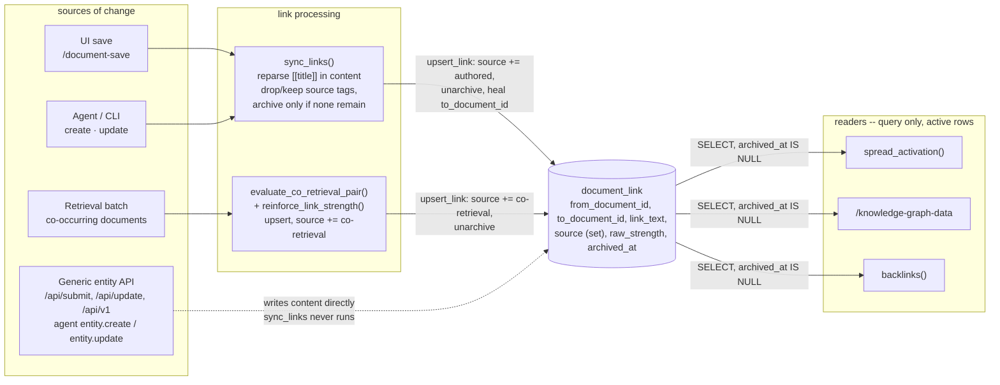

# document_link: how links get created and read

Two writers feed the `document_link` table, and every reader queries it directly -- nothing re-parses a document's body to answer a retrieval or render the graph explorer. A link is never deleted once it exists: losing its markup or its usage signal archives it, and either an author retyping it or retrieval re-discovering it brings it back at its old strength, not a fresh one. The one place the sync guarantee still breaks is a generic write path with no document-specific hook.

## Write path: two writers, one table, one upsert

**Authored links** come from parsing the saved document body, not from a separately edited field. `document.create_page`/`update_page` (`src/document.lua:665-685`) call `document.sync_links` unconditionally after every save, which re-parses the fresh content for `[[title]]` markup (`string.gmatch`, `:534-541`) and resolves each via `parse_link_ref`/`resolve_link` (`:402-434`). Every real write surface routes through these two functions: the UI's `/document-save`, the agent's create/update tools, the knowledge-pool session/note writers, and CLI bulk import.

**Co-retrieval links** are behavioral, not textual -- no `[[...]]` markup involved. When a retrieval batch finishes, `knowledge.review_retrieval` calls `maybe_link_co_retrieved` -> `evaluate_co_retrieval_pair` (`src/knowledge.lua:871-895`), which asks an LLM to judge the pair and, on `"YES"`, writes the link. Neither path writes `document_link` directly any more -- both funnel through one helper.

## Archiving and reintroduction

`document.upsert_link` (`src/document.lua:484-505`) is the only place a link's introduction -- first or repeat -- gets written. `source` is no longer a single mutable enum; it's a small sorted, comma-joined set of every way a link has ever been introduced (`document.source_set_add`/`source_set_remove`, `:442-482`) -- `"authored"`, `"co-retrieval"`, or `"authored,co-retrieval"` when both apply. A fresh pair inserts; an existing pair (active or archived) gets the new tag folded into its set, is unarchived, and has its `to_document_id` healed if it was previously dangling (`NULL`) and this call resolved to a real target. Reintroduction never resets `raw_strength`.

`sync_links` (`:520-561`) no longer deletes. For each of a document's existing `authored`-tagged rows whose markup is gone from the fresh content, it removes just the `"authored"` tag (`source_set_remove`); if nothing else backs the row (no `"co-retrieval"` tag left), it's archived (`archived_at` set) -- otherwise it stays active, since usage still vouches for it even though the author's text no longer does. Every link still present in content goes through `upsert_link`, so retyping a deleted `[[link]]` reintroduces the same row at its old strength rather than starting over at `BASE_LINK_STRENGTH`.

The co-retrieval side reintroduces the same way, through a different door: `document_link_exists` (`src/knowledge.lua:770-782`) is deliberately unfiltered by `archived_at`, so a repeat co-retrieval hit on an existing pair -- archived or not -- takes the *reinforce* branch in `maybe_link_co_retrieved` rather than re-asking the LLM to re-judge a pair it already judged once. `reinforce_link_strength` (`:796-822`) folds `"co-retrieval"` into the row's source set and clears `archived_at` alongside its usual `raw_strength` bump -- a reinforcement event *is* a reintroduction event. It selects the matching row(s) by hand rather than a single blind `UPDATE`, since more than one row can span the same pair (see "Known limitations" below).

Existing rows default to `archived_at = NULL` (active) -- the migration needs no backfill.

## The gap: a bypass that skips sync_links

`entity.create`/`entity.update` (`src/entity.lua`) are the generic, schema-driven row writers every entity type shares, and they have no document-specific hook -- no call to `sync_links` anywhere in `entity.lua`. Reachable with `entity_type = "document"` from `/api/submit`, `/api/update`, `/api/v1`, and the agent's generic entity tools, this path writes straight to `content` and leaves `document_link` exactly as it was. The codebase already names this, not just inferred here: `src/document.lua`'s own comment on `entity create-json` states it skips `document.create_page`'s side effects, leaving new/edited documents invisible to backlinks until a manual reindex. A backfill exists -- `document.resync_links` -- but nothing calls it automatically, so a bulk import or generic API write is a silent, standing drift between a document's actual text and what the graph believes about it. This drift now heals itself the moment anything else touches the same link (a later authored edit, or a co-retrieval hit), rather than requiring the operator to know to run the backfill -- but until then, it's still silent.

## Read path: query, active rows only, never re-parse

Every consumer of the graph is a plain SQL read against `document_link`, not a text scan: `document.linked_neighbors` (`src/document.lua:584-597`), used by `knowledge.spread_activation` to spread retrieval activation to a document's neighbors; `document.graph_edges` (`:609-627`), backing `/knowledge-graph-data` and, through it, the knowledge-graph explorer's canvas; and `document.backlinks` (`:689-699`), shown on a document's own page. All three now filter `archived_at IS NULL OR archived_at = ''`, matching the same idiom `document.archived_at` itself already uses everywhere -- an archived link is invisible to every reader until something reintroduces it. This is the efficient half of the design, and the bypass above doesn't change that -- reads stay cheap, they just risk being cheap and stale for any document that entered or changed through the generic entity path.

## Rendering is a separate, independent parser

Turning `[[title]]` into a clickable link *on the page* is a different code path from indexing it into the graph. `document.render_html` (`:776-781`) calls `document.inline_links_to_markdown` (`:710-719`), which runs its own fresh `[[...]]` regex match and its own `resolve_link` call -- it never reads `document_link`, and is unaffected by archiving (archived or not, the row it might correspond to plays no part in rendering). That makes rendering immune to the bypass gap above in one direction (a reader always sees links that match the text they're looking at right now) but not the other: a document written through the generic entity path can render a link on screen that `document_link` -- and therefore the graph explorer, backlinks, and spread activation -- doesn't know exists yet.

## Known limitations (not fixed by archiving)

Found while researching the design above; real, but out of scope for the archive/reintroduce work:

- **Parallel edges.** The primary key is `(from_document_id, link_text)`, not `(from_document_id, to_document_id)` -- two authored spellings of the same target (`[[Home]]` vs `[[Root/Home]]`), or an authored link whose `link_text` happens to differ from a co-retrieval row's (which always uses the target's exact title), produce two separate rows for the same pair. `linked_neighbors` sums their strengths (intentionally); `graph_edges` and `backlinks` do not dedupe and show/list each row separately; `spread_activation` therefore double-weights the pair.
- **Target rename decay.** A link's `to_document_id` is resolved once and stored -- renaming the target doesn't break it immediately (reads still use the stored id). But `sync_links` re-parses and re-resolves the *source* document's raw text on every one of its own future saves, even unrelated ones -- so the next time the source document is saved, resolution is retried against the old literal text, fails, and the link silently downgrades to dangling (`to_document_id = NULL`), losing the target association it previously had.
- **Archived/merged targets still drain pool heat.** `linked_neighbors` has no `archived_at`/`merged_into` filter on the *neighbor* side (unlike `graph_edges` and `backlinks`), so `spread_activation` can keep reinforcing a document that was already archived (and had its heat returned to the pool), continuously re-inflating a departed document's heat at the active pool's expense.
- **No self-link guard.** Nothing prevents `from_document_id == to_document_id`; a document linking to its own title produces a self-loop that inflates its own neighbor-strength denominator in `spread_activation`.
- **Ambiguous title resolution.** Multiple non-archived documents sharing a title resolve to the lowest id (`ORDER BY id ASC`), not most-recent or best-match. Subject-qualified links (`[[subject/title]]`) require an exact, untrimmed parent-title match and fall through to no match (not back to the plain-title case) if the subject doesn't match.
- **No transactions.** `sync_links`'s read-decide-write sequence runs as multiple independent autocommitted statements (this codebase's DB layer opens a fresh connection per statement). A reader can observe a document's links mid-resync, and two concurrent saves of the same document can interleave into a state matching neither save's content.
