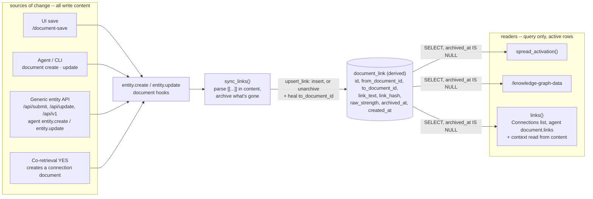

# document_link: how links get created and read

Content is the only place knowledge lives. `document_link` is a purely derived index of the `[[links]]` in document content: dropping it and running `daat repair links` loses nothing but usage metadata (strength, archive and creation times). Every reader queries the index; only one writer fills it, from content, and it runs on every write path. *Why* two documents are connected is never stored on a link -- it's the sentence around the link in content, or a document that links both and says why, written the same way by a person or the agent.

## One grammar

A link is `[[target]]` or `[[folder/target]]` on a single line, with no brackets inside (`LINK_PATTERN`, `src/document.lua`). Indexing (`sync_links`) and rendering (`inline_links_to_markdown`) share that one pattern, so they can never disagree about what's a link. An unclosed `[[` therefore matches nothing -- it's plain text on the page and never an index row -- instead of swallowing everything up to the next `]]`. There's no length limit: a link is as long as the title it names.

## One writer: content, on every write path

`document.sync_links` runs from entity's own document hooks -- `document.on_entity_created` (called by `entity.create`) and `document.on_entity_updated` (called by `entity.update` on a real change to `content`) -- so every write path keeps the index in step with content: the UI's `/document-save`, the agent's document tools, the generic entity paths (`/api/submit`, `/api/update`, `/api/v1`, the agent's `entity.create`/`entity.update`, `entity create-json`/`update-json`), and the knowledge pool's own notes. The same hooks compute the document's embedding.

`sync_links` makes a document's rows match its content: every `[[link]]` in it goes through `document.upsert_link`, and every active row whose link text no longer appears is archived, not deleted, so `raw_strength` survives the link being retyped later -- retyping a deleted link reintroduces the same row at its old strength rather than starting over at `BASE_LINK_STRENGTH`. `upsert_link` also heals a dangling row (`to_document_id` NULL) once its target resolves, and never replaces a target it already has.

A dangling link heals on its own too: creating, renaming, moving or unarchiving a document runs `document.resolve_dangling_links`, which re-resolves every active dangling row, so a bulk import's forward links complete as their targets arrive. `daat repair links` is left for content that reached the table without going through `entity` at all -- a raw SQL insert, a restored backup.

Rows are keyed by their own `id`, with uniqueness per (document, link text) enforced on `link_hash` (SHA-256 of the link text): link text is whatever a title is, and no key length can promise to hold that -- a real paper title overflowed the old `VARCHAR(255)` key.

## Why two documents are connected: in content, written the same way by anyone

There are exactly two ways to say why two documents are connected, and a person and the agent use the same ones:

- **Write it next to the link.** The sentence around `[[B]]` in A's content is A's explanation of the connection. `document.link_context` quotes it whenever the connection is shown (list/heading/quote/table markup stripped, links flattened); a bare link in a list of links falls back to the nearest heading above it (`Listed under "Related meetings"`).
- **Write a document that links both and says why** -- a connection document. It's an ordinary document: title `A ↔ B`, content one sentence linking both (`[[A]] and [[B]]: <why>`), filed under the Knowledge Pool folder. Its links come from its content like any other document's, it's searchable, embedded and versioned, and it takes part in heat and tiering like any other note. Editing it edits the explanation; archiving it removes the connection. `document.connection_draft` is the shared starting shape.

A person creates one with **Explain connection** on a document's Connections list, which opens `/document-edit?connect_a=<id>&connect_b=<id>` prefilled with the draft. The agent creates one when two documents keep being retrieved together: `knowledge.maybe_link_co_retrieved` asks the model to judge the pair (`YES: <sentence>` / `NO: <sentence>`, `knowledge.parse_link_judgment`), and on YES `evaluate_co_retrieval_pair` creates the connection document through the same `document.create_page` any save uses, attributed to the user whose retrieval surfaced it (the same convention every Knowledge Pool note follows). The verdict and its sentence are kept in `knowledge_link_review`, so a decline can be audited, and a pair that's already connected -- directly, or through any document linking both, whoever wrote it (`knowledge.documents_connected`) -- is never re-judged.

A pair connected through a connection document doesn't need its own direct edge: retrieving either end heats the connection document by spreading activation, so repeated co-retrieval accumulates heat exactly where the pair's shared relevance is written down -- which in turn makes that document due for review and distillation, the natural place for a summary of why the two keep coming up together. Direct links (A's content links B) are still strengthened on repeated co-retrieval (`knowledge.reinforce_link_strength`, active rows only -- retrieval never un-archives a link whose markup is gone).

A title containing a bracket or a newline can't be written as a link at all (the grammar has no escaping). A `/` is fine: `document.resolve_link_text` tries the whole text as a title first and only reads it as `subject/title` (split on the first `/`) when no document has that exact title, so `[[CRISPR/Cas9 in fungi]]` links as written and an exact title always wins. A title shared with another document needs its parent folder's title in front (`[[folder/title]]`); `document.link_ref` picks the right form or returns nil, and a pair either of whose documents can't be linked is recorded as `unlinkable` rather than re-asked.

## Migration from the old layout

Every store before this layout keyed `document_link` by `(from_document_id, link_text)` and held links no content backed: rows the co-retrieval judgment created directly (`source = 'co-retrieval'`), plus per-link notes. On the first request after the upgrade, `migrate_document_link_layout` (`src/document.lua`) rebuilds the table once: content-backed rows, and archived rows (for their strength), are copied into the new layout; co-retrieval-only rows are not -- no document holds them, so a content-derived index can't -- and stay behind in `document_link_legacy` for the deployment to turn into connection documents and then drop. Notes are not carried over; the sentence around a link is read from content. On MySQL the rebuild runs under a named lock (`GET_LOCK`), since every request runs schema init and DDL isn't transactional, and it copies into `document_link_new` before swapping names, so a failure part-way leaves the old table untouched.

## Read path: query, active rows only, never re-parse

Every consumer of the graph is a plain SQL read against `document_link`, not a text scan: `document.linked_neighbors`, used by `knowledge.spread_activation` to spread retrieval activation to a document's neighbors; `document.graph_edges`, backing `/knowledge-graph-data` and the knowledge-graph explorer's canvas; and `document.links`, both directions, behind a document page's Connections list and the agent's `document.links` tool. All three filter `archived_at IS NULL OR archived_at = ''`. `document.links` adds each link's context by reading the holding document's content -- the one read that looks at text, since that's where the explanation lives.

## Rendering

`document.render_html` calls `document.inline_links_to_markdown`, which runs the same `LINK_PATTERN` and its own `resolve_link_text` call -- it never reads `document_link`, so a reader always sees links that match the text in front of them, even for content inserted outside `entity` whose rows haven't been rebuilt yet (`daat repair links`).

## Known limitations

- **Parallel edges.** Two spellings of the same target (`[[Home]]` vs `[[Root/Home]]`) are two rows for the same pair. `linked_neighbors` sums their strengths (intentionally); `graph_edges` and `links` list each row separately; `spread_activation` therefore double-weights the pair.
- **Archived/merged targets still drain pool heat.** `linked_neighbors` has no `archived_at`/`merged_into` filter on the *neighbor* side (unlike `graph_edges` and `links`), so `spread_activation` can keep reinforcing a document that was already archived, re-inflating a departed document's heat at the active pool's expense.
- **No self-link guard.** Nothing prevents `from_document_id == to_document_id`; a document linking to its own title produces a self-loop that inflates its own neighbor-strength denominator in `spread_activation`.
- **Ambiguous title resolution.** Multiple non-archived documents sharing a title resolve to the lowest id (`ORDER BY id ASC`), not most-recent or best-match. Subject-qualified links (`[[subject/title]]`, read that way only when no document is titled exactly `subject/title`) require an exact parent-title match and fall through to no match (not back to the plain-title case) if the subject doesn't match. `document.link_ref` accounts for this when it writes a link itself.
- **No transactions.** `sync_links`'s read-decide-write sequence runs as multiple independent autocommitted statements. A reader can observe a document's links mid-resync, and two concurrent saves of the same document can interleave into a state matching neither save's content.
