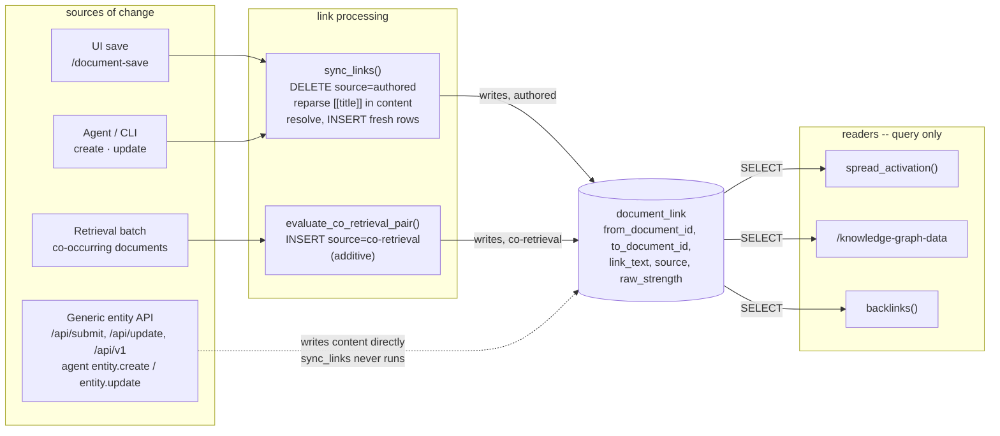

# document_link: how links get created and read

Two writers feed the `document_link` table, and every reader queries it directly -- nothing re-parses a document's body to answer a retrieval or render the graph explorer. The one place that guarantee breaks is a generic write path with no document-specific hook.

## Write path: two writers, one table

**Authored links** come from parsing the saved document body, not from a separately edited field. `document.create_page`/`update_page` (`src/document.lua:544-565`) call `document.sync_links` unconditionally (lines 550, 562) after every save, which does a full delete-and-reparse for that one document: `DELETE FROM document_link WHERE from_document_id = ? AND source = 'authored'` (`src/document.lua:427-429`), then regex-scans the fresh content for `[[title]]` (`string.gmatch`, `:434`), resolves each via `parse_link_ref`/`resolve_link` (`:384-416`), and inserts one row per link. Every real write surface routes through these two functions: the UI's `/document-save` (`src/cgi.lua:1120-1128`), the agent's create/update tools (`src/agent.lua:1235, 1251`), the knowledge-pool session/note writers (`src/knowledge.lua:211, 245, 249`), and CLI bulk import (`src/document.lua:1357`).

**Co-retrieval links** are behavioral, not textual -- no `[[...]]` markup involved. When a retrieval batch finishes, `knowledge.review_retrieval` (`src/knowledge.lua:377`) calls `maybe_link_co_retrieved` (`:459, 827-849`) -> `evaluate_co_retrieval_pair` (`:851-880`), which inserts a row with `source = 'co-retrieval'` (`:872-875`). This path is additive-only by design (`:651-658`) and is never touched by `sync_links`'s delete, since that delete is scoped to `source = 'authored'` (`src/document.lua:421-429`) -- a co-retrieval edge survives text edits to either endpoint.

## The gap: a bypass that skips sync_links

`entity.create`/`entity.update` (`src/entity.lua:293, 406`) are the generic, schema-driven row writers every entity type shares, and they have no document-specific hook -- no call to `sync_links` anywhere in `entity.lua`. Reachable with `entity_type = "document"` from `/api/submit` (`src/cgi.lua:1656`), `/api/update` (`:1694`), `/api/v1` (`:1840/1851/1884`), and the agent's generic entity tools (`src/agent.lua:1459, 1484`), this path writes straight to `content` and leaves `document_link` exactly as it was. The codebase already names this, not just inferred here: `src/document.lua:1329-1334`'s own comment on `entity create-json` states it "skips `document.create_page`'s own side effects (`document.sync_links` for backlinks...)," leaving new/edited documents invisible to backlinks until a manual reindex. A backfill exists -- `document.resync_links` (`src/document.lua:1092-1099`) -- but nothing calls it automatically, so a bulk import or generic API write is a silent, standing drift between a document's actual text and what the graph believes about it.

## Read path: query, never re-parse

Every consumer of the graph is a plain SQL read against `document_link`, not a text scan: `document.linked_neighbors` (`src/document.lua:464-477`), used by `knowledge.spread_activation` (`src/knowledge.lua:903-904`) to spread retrieval activation to a document's neighbors; `document.graph_edges` (`src/document.lua:489-507`), backing `/knowledge-graph-data` (`src/cgi.lua:877`) and, through it, the knowledge-graph explorer's canvas (`doc/knowledge-graph-explorer.md`); and `document.backlinks` (`src/document.lua:568-579`), shown on a document's own page (`src/cgi.lua:1051`). This is the efficient half of the design, and the bypass above doesn't change that -- reads stay cheap, they just risk being cheap and stale for any document that entered or changed through the generic entity path.

## Rendering is a separate, independent parser

Turning `[[title]]` into a clickable link *on the page* is a different code path from indexing it into the graph. `document.render_html` (`src/document.lua:655-660`) calls `document.inline_links_to_markdown` (`:589-598`), which runs its own fresh `[[...]]` regex match and its own `resolve_link` call -- it never reads `document_link`. That makes rendering immune to the bypass gap above in one direction (a reader always sees links that match the text they're looking at right now) but not the other: a document written through the generic entity path can render a link on screen that `document_link` -- and therefore the graph explorer, backlinks, and spread activation -- doesn't know exists yet.
